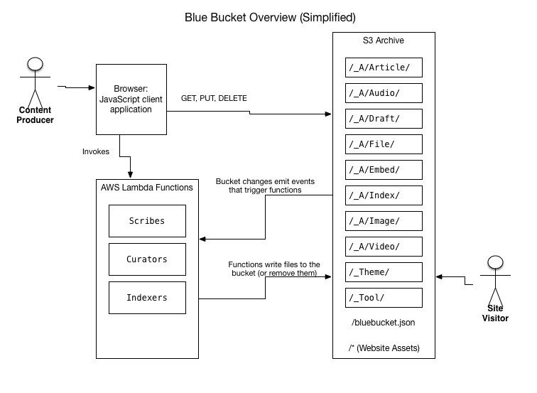
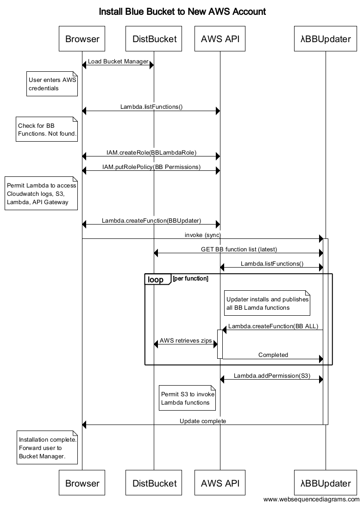
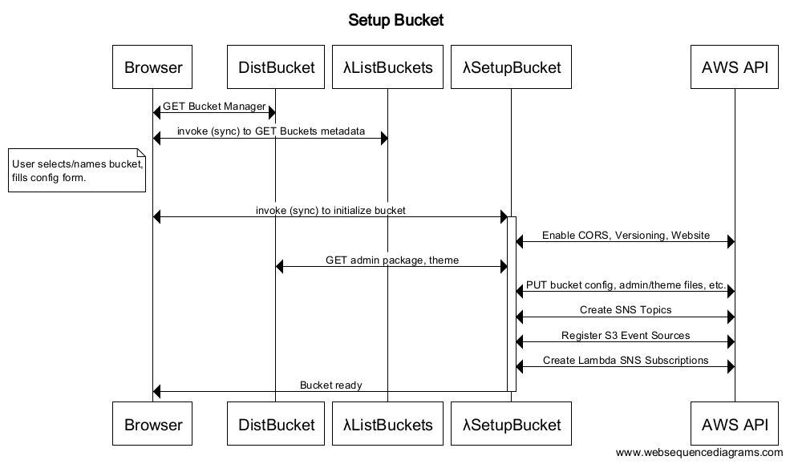
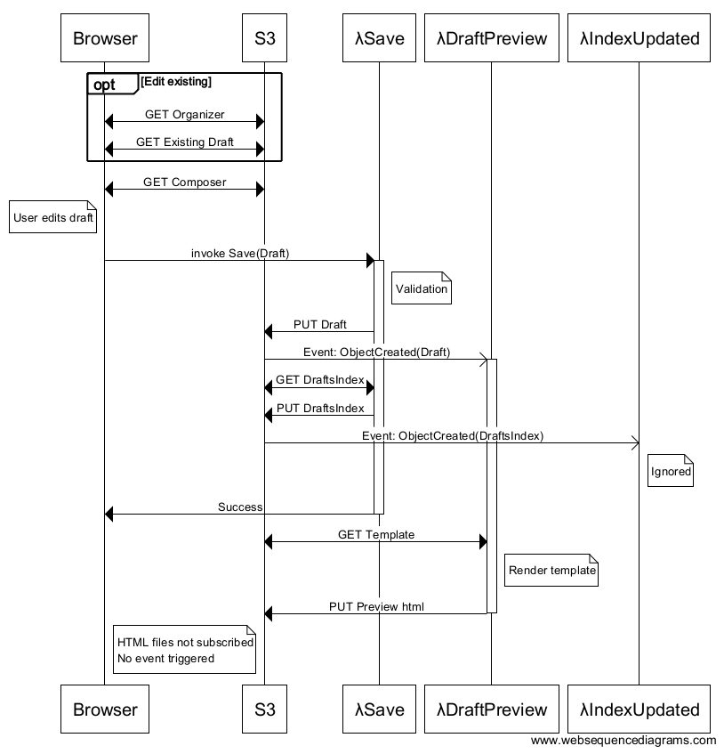
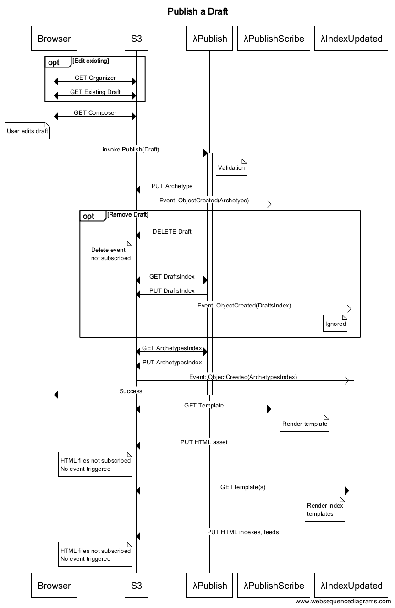

# Blue Bucket Architecture

The Blue Bucket architecture principals serve as a decision framework, a guide
to help us design the system correctly. When we need to make a decision about
how (or whether) to do something, we'll refer to these principles to help us
make the right choice.

Here are some down-to-earth principles used in Blue Bucket's design:

* Web standards are the instruction manual.
* Cloud services are the magic sauce. Hardware and software are anti-patterns.
  Minimize use of infrastructure and custom code.
* Small pieces, loosely joined, are better than big, complex tools. Each
  component of the system should have only one task, and should perform that
  task very well.
  Also known as the [Single Responsibility Principle][].
* The file system is the canonical repository. Every artifact of the site is
  stored in, or derived from, flat files. An end
  user should be able to reproduce the entire system given the repository.

These are our values, the outcomes we desire from our architecture:

* Portability is paramount. Users must be able to extract their content at any
  time and abandon the software without losing any data.
* Scalability goes in both directions. The system must aim to perform well at
  very small scale as well as very large scale.
* Composability is valuable. The system should be interoperable with existing
  systems, preserving user choice of tools.

## Some definitions

For this discussion we will be using the metaphor of our system as a
**library**, and the software processes as **agents** or employees in our
library.

I apologize in advance to professionals in the library science field. The
metaphors I have adopted to describe the Blue Bucket architecture misuse and
abuse the language of that field. Nevertheless I find the library metaphor, if
sometimes misapplied, still eases communication and understanding, because it is
so much easier to talk about Archivists and Scribes than about "repository
manager" and "format transformer."

If this is the digital library of your content, in the Blue Bucket architecture
S3 is the **archive**, the repository where all your materials are kept.
Conveniently, S3 stores items in what it calls "buckets." We'll just paint ours
blue!

Files stored in our archive are either **sources** or **artifacts**. Sources get
uploaded by external agents called **curators**. Artifacts get created by
**scribes**, agents implemented as Lambda functions.

An **item** is a generic, abstract *thing* that we want to store in our archive.
An item may have many different artifacts in the archive that represent it. For
example, an item might be a picture. In the archive, that item might be
represented as a PNG image file, *and* as a smaller thumbnail image, *and* as an
HTML page that features that image in its body content, *and* as a JSON file
storing metadata about the picture. All these artifacts represent the same item,
the picture.

An **archetype** is the canonical representation of an item in our archive. We
will store them as JSON files. Each source item is transformed into one or more
archetypes. All other artifacts are derived from the archetype.

An **asset** is an artifact associated with an archetype. Typically, an
archetype will store metadata about the content and a pointer to one or more
assets. The asset will store the actual content of the item. Sometimes this will
be identical to the source (e.g. if the source is a PDF file). Other time is
will be different (e.g. the HTML fragment produced from a Markdown source).

A **monograph** is a generated artifact derived from a single archetype, for
example an article page.

An **anthology** is a generated artifact derived from more than one archetype,
for example an index page.

A **template** is a file used to perform transformation of an archetype into an
artifact.

[Single Responsibility Principle]: https://en.wikipedia.org/wiki/Single_responsibility_principle

## The Archive, Artifacts, and Scribes

At the center of the blue bucket architecture is the Archive, the S3 bucket (or
directory) where the content is kept. The things we store in the Archive we
shall call Artifacts. Artifacts come in several types, defining their role in
the system. Here is a high-level overview of how the Archive is organized.

### Archetypes

The most important Artifact in the Blue Bucket system is the Archetype. The
Archetype is a JSON-formatted file representing each page, article, photo, or
other content item on our web site. We use the JSON format because 1) we want to
store structured data about our content as well as unstructured content itself,
and 2) we want a format that will be usable by our client JavaScript
applications.

Archetypes are kept in their own directory, and have a `.json` extension. This
makes it easy to create S3 event sources that target only Archetypes. When an
Archetype is saved or deleted, S3 sends the event to a Scribe, an AWS Lambda
function. The Scribe will then generate website assets for the Archetype.
Typically, it will do this by combining the Archetype with a Template to produce
a *Monograph,* a web page, though different archetypes may produce other assets.

### Drafts

For works in progress, we have a Drafts folder. Drafts are stored in the same
format as Archetypes. Like Archetypes, there is a Scribe watching for change
events in the Drafts folder, and it will generate Preview assets on changes so
that you can view your work as it will appear on the website proper.

CAVEAT: In version 0.1, **the Drafts folder is publicly accessible.** Although
Drafts are not advertised or exposed on the website proper, it would be trivial
for an Internet visitor to get access to them, if they know their way around the
Blue Bucket Archive, and nothing in the system prevents them from viewing them.
Private drafts are on the roadmap for future development.

### Indexes

Aside from data storage, another useful function of a database is to create
indexes over all the objects in your archive. Indexes are quite useful when you
want to create ordered collections, or to search and filter your collections to
find specific content.

However, just like web pages, indexes can be pre-generated at publish time and
stored in the archive in a static file (in fact, that's how databases work
internally). Blue Bucket does exactly that, storing our indexes as JSON files,
and making them available to our JavaScript clients just like the rest of our
data. Blue Bucket creates indexes over both Archetypes and Drafts.

In deployments with a very high publishing velocity (periods of publishing
more than one item per second) the index files may become a
bottleneck, because more than one Lambda function may be trying to update them
at once. In future versions, Blue Bucket may introduce the option to use
DynamoDB or an SQL database to manage indexes and deal with write contention. In
that case, the JSON index files would be rebuilt on a schedule, perhaps once a
minute, resulting in some publishing latency. However, real life usage is likely
not to hit these limits in the near term.

In publishing operations with very large archives, these index files could grow
quite large, which may result in performance problems for clients. Future
versions of Blue Bucket will resolve this issue by sharding the index;
that is, by splitting the index across more than one file, in such a way that
clients will typically require access to only a small number of shards.

(Technical side note: I experimentally created an index of 40,000 items,
equivalent of a blog that posted 10 times a day for 10 years. This resulted in
an index file of about 10MB uncompressed. Updates to this index took about 2.5
seconds, which is still well within the usable range for such a blog. However,
clients needing access to the index might have difficulty grabbing such a large
file, especially mobile clients.)

In version 0.1, Scribes are pulling double duty as Indexers. In future versions,
these roles may be separated into different agents.

### Curators

A Curator is any agent that places content into (or removes content from) the
Archive. This may include content publishing tools, or feed import scripts.
Typically, a Curator will write content to the Drafts folder, and then request
the Publisher to publish it for them (see under process architecture below).
However, there may be cases where Curators write directly to the Archetypes
folder or the main website. In future versions of Blue Bucket, we will examine
these use cases and adjust as needed. Blue Bucket has a folder for storing
Curators.

Version 0.1 of Blue Bucket comes with a Curator: an embarrassingly basic
browser-based publishing application. This version is meant more as a proof of
concept and testing tool rather than a real interface for production use. Future
versions will ship with additional Curators. 

Notice, however, that the publishing tools are cleanly separated from the rest
of the system. A Curator interacts with the Archive through simple APIs and JSON
files. In the same way that a typical website management tool allows you to
install themes that modify the look and feel of your website, Blue Bucket allows
pluggable administration tools.

Future versions of Blue Bucket will expose an HTTP publishing API (via AWS API
Gateway), allowing external Curators to help manage Archive content as well.

### Themes

A Theme is a collection of assets used by Scribes or clients to format your
website. A typical Theme will consist of HTML page templates, CSS files,
JavaScript files, and image assets. As with most web publishing systems, Blue
Bucket Themes are pluggable.

Version 0.1 of Blue Bucket ships with a minimalist Theme that should be useful
as proof of concept and testing, but probably is not useful for a real public
website. Future versions of Blue Bucket will elaborate extensively on the Theme
architecture to ensure Theme developers have a great experience building for the
platform.

Version 0.1 has several technical constraints that will be loosened in future
versions. Chief among these is that it must use Jinja2 templates. I chose this
template system only because it is one I am familiar with. However, Blue Bucket
in future should support pluggable template systems, so that a Theme developer
could build Templates in a language of their choice.

## The Agent Model

An important aspect of the Blue Bucket architecture is that it is an agent-based
system. Each function of the system is an independent agent (a microservice, to
use a buzzword), that communicates with other agents via simple protocols and
messages. An interesting and intentional consequence of this is that agents can
be implemented in any programming language supported by the underlying platform.
This AWS implementation using Lambda functions can therefore have agents written
in JavaScript, Java, or Python (at the time of this writing, more to come no
doubt).

As we expose more HTTP APIs in future versions, certain functions can be
implemented external to the system, opening even more possibilities of
development platform.

The architecture should also be portable to different platforms. I have chosen
to build on AWS because it is the most mature provider of utility computing
service. However, the architecture should work just as well on Google Cloud
Platform or Azure or any other platform that provides the building blocks. With
a little effort, you could adapt it to work on a personal Linux server using a
standard file system and inotify.

In version 0.1 the code is not pluggable enough to swap out platforms easily.
However, I have made an effort to isolate platform-dependent functions to make
future porting easier. Key issues are the input-output functions for managing
the Archive, which have mostly been isolated to the archivist class, and the
details of interpreting event messages, which still needs to be abstracted.

## Workflows

Some important facts/constraints to understand:

- AWS S3 API does not enable CORS. This means you cannot reliably access S3 API
  functions from the browser client. Some S3 functions will have to be
  implemented as Lambdas invoked from the browser.
- Lambda function names are scoped to the account, so everyone can have the same
  BB function names. The updater relies on these names being consistent.
- S3 Bucket names are global, not scoped to the account, so the BB code cannot
  know by hard-coded names what bucket(s) it needs to manage. Since it also has
  no data store other than S3, the Updater must scan all buckets to find managed
  ones. This could be a performance problem if an account has a large number of
  buckets. This is only a problem for the Updater. Other functions are invoked
  with a bucket argument.
- All buckets in the account will have to use the same version of the Lambda
  functions. Could make upgrades troublesome in future. Take care.

### Installing Blue Bucket in a new AWS account

The bucket initializer can run on any domain anywhere. I’ll host one publicly.

- LOGIN If no credentials found in local storage, display LOGIN FORM. Ask for
  AWS key and secret. Store locally, do not send to source server.
- Browser calls Lambda.listFunctions() to ensure BB functions are available. If
  required functions are missing, we need to go through the update process.
- Browser Calls IAM.createRole() to create a role for BB Lambda functions to
  assume.
- Browser Calls IAM.putRolePolicy() to permit the BB Lambda functions to access
  Cloudwatch logs, S3, Lambda, and API Gateway. Later maybe add other services
  like DynamoDB, Route53, etc.
- Browser Calls Lambda.createFunction (or UpdateFunctionCode) to install the
  latest BB Updater Lambda function.
- Browser Invokes (sync) the BB Updater to complete the installation.
- BB Updater calls Lambda.addPermission() to allow S3 to invoke functions.
  (Note: This is a call to the Lambda API, NOT the IAM API.)
- BB Updater installs all BB Lambda functions.
- BB Updater scans for managed buckets to upgrade, but finds none.

### Setup a Blue Bucket Site

- Browser invokes Lambda BBListBuckets to retrieve buckets metadata and Display the BUCKET MANAGEMENT FORM. NOTE: Version 0.1 does not support initializing non-empty buckets. Metadata returned must include whether bucket is empty.
- User selects or names a bucket to initialize (and create if it does not already exist). NOTE: Version 0.1 does not support initializing non-empty buckets.
- Browser client displays a BUCKET CONFIG FORM for some common configuration options to generate bluebucket.json.
- Browser client invokes (sync) Lambda BBSetupBucket with bucket and config.
- BBSetupBucket retrieves the zip files for admin and theme from the public distribution bucket.
- BBSetupBucket installs the directory skeleton, admin files, and generated bluebucket.json, into selected bucket.
- BBSetupBucket registers S3 Event Sources for BB Lambdas. (NOTE: This is a call to S3 API, not Lambda.)
- JS will redirect you to the admin section of your new blue bucket. You must enter your creds again because of cross-domain security.

### Creating a draft

### Publishing a draft

