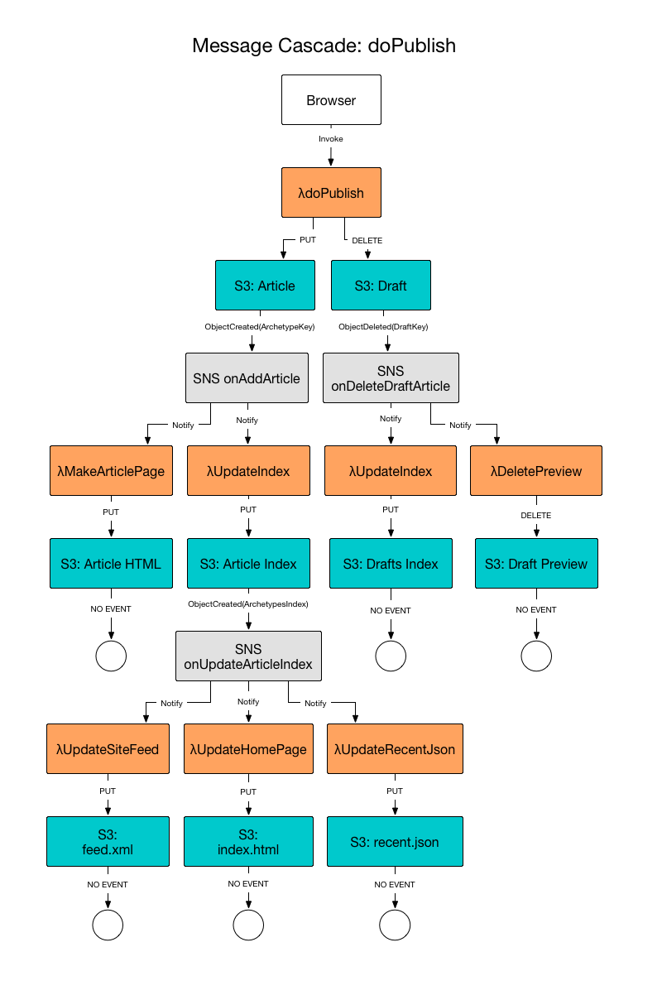

# Blue Bucket Architecture

The Blue Bucket architecture principals serve as a decision framework, a guide
to help us design the system correctly. When we need to make a decision about
how (or whether) to do something, we'll refer to these principles to help us
make the right choice.

Here are some down-to-earth principles used in Blue Bucket's design:

* Web standards are the instruction manual.
* Cloud services are the magic sauce. Dedicated hardware and custom software are
  anti-patterns; minimize their use.
* Small pieces, loosely joined, are better than big, complex tools. Each
  component of the system should have only one task, and should perform that
  task very well. Also known as the [Single Responsibility Principle][].
* The file system is the canonical repository. Every artifact of the site is
  stored in, or derived from, flat files. An end user should be able to
  reproduce the entire system given the repository.

These are our values, the outcomes we desire from our architecture:

* Portability is paramount. Users must be able to extract their content at any
  time and abandon the software without losing any data.
* Scalability goes in both directions. The system must aim to perform well at
  very small scale as well as very large scale.
* Composability is valuable. The system should be interoperable with existing
  systems, preserving user choice of tools.

## Some definitions

For this discussion we will be using the metaphor of our system as a
**library**, and the software processes as **agents** or employees in our
library.

I apologize in advance to professionals in the library science field. The
metaphors I have adopted to describe the Blue Bucket architecture misuse and
abuse the language of that field. Nevertheless I find the library metaphor, if
sometimes misapplied, still eases communication and understanding, because it is
so much easier to talk about Archivists and Scribes than about "repository
manager" and "format transformer."

If this is the digital library of your content, in the Blue Bucket architecture
S3 is the **archive**, the repository where all your materials are kept.
Conveniently, S3 stores items in what it calls "buckets." We'll just paint ours
blue!

Files stored in our archive are **assets**. Assets may be uploaded by external
agents called **curators**. Assets uploaded by curators are called **sources**.
Other assets may be created by our internal processes.  Internal processes that
create assets are called **scribes**, and the assets they create are called
**artifacts**.

An **item** is a generic, abstract *thing* that we want to store in our archive.
An item may have many different assets in the archive that represent it. For
example, an item might be a picture. In the archive, that item might be
represented as a PNG image file, *and* as a smaller thumbnail image, *and* as an
HTML page that features that image in its body content, *and* as a JSON file
storing metadata about the picture. All these assets represent the same item,
the picture.

An **archetype** is the canonical representation of an item in our archive.
Archetypes are stored as JSON files in a dedicated subdirectory. An archetype
contains metadata about the item, and (usually) pointers to all its assets.
Archetypes are the key assets of the Blue Bucket system, and their manipulation
drives many of the processes, as explained below.

A **template** is a file used to perform transformation of an archetype into an
artifact.

[Single Responsibility Principle]: https://en.wikipedia.org/wiki/Single_responsibility_principle

## Overview of Typical Workflow

At the center of the blue bucket architecture is the Archive, the S3 bucket (or
directory) where the content is kept. All assets of your website are stored in
the bucket. All assets needed by the system to maintain your website are stored
in the bucket. Here is a high-level overview of how the Archive is organized and
the concept of the system's operation.

### Archetypes and Scribes

The most important asset in the Blue Bucket system is the Archetype. The
Archetype is a JSON-formatted file representing each page, article, photo, or
other content item on our web site. We use the JSON format because 1) we want to
store structured data about our content as well as unstructured content itself,
and 2) we want a format that will be easily usable by our client JavaScript
applications.

Archetypes are kept in their own directory, organized by *item class,* and
have a `.json` extension. This makes it easy to create S3 event sources that
target only Archetypes. 

There is a fixed set of supported item classes, as depicted in the diagram. They
are (alphabetically):

* Article: a text/html item intended to be displayed as a stand-alone web page.
* Audio: an audio item.
* File: a generic item that does not fall into any other class (e.g. a zip
  file for download).
* Embed: a text/html item that may be used as a component in a web page, but is
  not intended to stand alone. This may be third party content, like a YouTube
  video embed, or local content like an interactive data visualization.
* Image: a picture or graphic.
* Video: a video item stored locally (third party videos should be Embeds).

When an Archetype is saved or deleted, S3 sends an event message to a Topic in
the Simple Notification Service (SNS). Each item class has two topics that can
be monitored, one for Save events, and one for Delete events.

Software agents called Scribes (AWS Lambda functions) subscribe to these events
and are notified when something in the archive changes. The Scribe will then
generate artifacts to be presented on the website. For example, if the archetype
was an Article, the Scribe might get the HTML content, render it using a
template to produce a full web page, and store that web page back into the
archive, ready for public view.

For works in progress, we have a Drafts folder. Drafts are stored in the same
format as Archetypes. Like Archetypes, there are Scribes watching for change
events in the Drafts folder, waiting to generate Preview assets on changes so
that you can view your work as it will appear on the website proper.

### Curators

A Curator is any agent that places content into (or removes content from) the
Archive. This may include browser-based content publishing tools, internal feed
import scripts, or external sources with permission to access our API.

A prototypical workflow for internal curators would be:

- Curator writes the source asset to the general archive, as a Draft (that is,
  without granting public read permission).
    - Note: Image, Audio, and Video assets are treated specially, because the
      system may perform special processing on them. Therefore, they are grouped
      in the main archive with a common prefix by asset-type.
    - This is a direct PUT to the S3 bucket, no Lambda functions are directly invoked.
    - If the upload fails, the curator can alert the user (if interactive) or
      log an error.
- Curator writes the archetype (metadata) for the item to the draft archetypes
  directory for that item class, e.g. `/_A/Draft/Image/<filename>`.
    - This is done by invoking λdoSave<ItemClass>().
    - The doSave routines extract embedded metadata from the asset (its key must
      be provided in the metadata), merge this with user-provided metadata, and
      PUT the combined archetype to the bucket.
    - If doSave fails, curator can alert the user (if interactive) or log an
      error.
- S3 sends a message to the SNS Topic BBonAddDraftImage.
- User elects to publish.
- Curator invokes λdoPublish().
- doPublish grants public read on asset. Then moves the archetype from Draft to
  Published location. If either operation fails, the user is alerted (if
  interactive) or an error is logged.
- S3 sends a message to the SNS Topic BBonAddImage and BBonDeleteDraftImage.

Notice that the publishing tools are cleanly separated from the rest of the
system. A Curator interacts with the Archive through simple APIs and files.
In the same way that a typical website management tool allows you to install
plugins, Blue Bucket allows pluggable administration tools as well. The major
work of the system is driven by events triggered after the curator's
interactions.

### Indexes and Index Subsets

Internally, agents in the Blue Bucket system *could* discover all the content
available in the archive by listing the files. However, there are several
disadvantages to using this method for content discovery.

* File listings are always sorted lexically (alphabetically) by key, but the
  most common sort need on the web is reverse chronological.
* S3 ListObjects calls are as expensive as writes in terms of financial costs,
  whereas reads are much cheaper.
* S3 ListObjects calls can only return a fixed set of object metadata. Custom
  metadata is not returned, nor can the contents of the object be returned.
  These data must be retrieved separately.
* S3 allows subsets of listings based only on key prefix. Often, it is desirable to
  define subsets that are not based on the key prefix.
* S3 ListObjects calls are not permitted at the website endpoint, so basic
  JavaScript clients cannot access them.

To address these concerns, Blue Bucket generates indexes to catalog all the
content in the archive, and stores those indexes as JSON files in the archive
itself.

Software agents called Indexers subscribe to the SNS add & delete topics for
each item class. Whenever an archetype is written, the Indexer receives a
message, and updates the appropriate index files in the bucket. 

There is a separate index for each item class, sorted reverse chronological by
updated date. 

The index records stored in the indexes provide a set of metadata designed
for typical use cases, including metadata that has been extracted from the
content of the archetype files, so many common use cases will be able to make do
with the index record alone, without having to fetch details for individual
assets.

Indexes are paginated to improve performance for large archives. Each page
contains a pointer to the previous and next page in the index (assuming one
exists). Clients can traverse the entire index if necessary, but the common use
case of "most recent X" should be satisfied with the first page.

The indexes are publicly readable, and so can be used by public JavaScript
clients without AWS API keys, as well as internal agents. (Note: to support
private drafts, drafts are indexed in a separate file that is not publicly
readable.)

The financial cost of producing these indexes is the same as performing a single
ListObjects call. Reading the index is ~14% of the cost of calling ListObjects.
So as long as you are using it more than once per write, you're saving money.
But in practice, producing the same results without a saved index would require
many, many calls to list and retrieve objects, so the comparison is unfair.

In addition to the main indexes, a site configuration can define index subsets
to be created by the Indexers. An index subset is is a filtered version of the
index such that each subset contains only items that fit specific criteria. For
example, it is common to create an index subset based on category, creating one
JSON file for "category=Technology" and another for "category=Humor". Another
common use is to create subsets by author. Index subsets are always based on
some metadata field found in the archetype.

Although the system does not (currently) place any constraints on the fields
that can be used as the basis for an index subset, to achieve good performance a
site owner should take care to create subsets only on metadata fields that have
a constrained number of values. Creating subsets based on a "tags" field, for
example, would likely create a huge number of files, which would be expensive
and of limited utility. 

Like the main indexes, index subsets are constrained to contain items of the
same item class. Site owners may need to declare the same subset on multiple
classes, for example if they want a per author file for Articles, Audio, Images,
and Video.

Index subsets take the place of the simplest and most common database queries
that a dynamic CMS would make. In future versions we will add mechanisms for
performing more complex query operations.

## Example Workflows

Some important facts/constraints to understand:

- AWS S3 API does not enable CORS. This means you cannot reliably access S3 API
  functions from the browser client. Some S3 functions will have to be
  implemented as Lambdas invoked from the browser.
- Lambda function names are scoped to the account, so everyone can have the same
  BB function names. The updater relies on these names being consistent.
- S3 Bucket names are global, not scoped to the account, so the BB code cannot
  know by hard-coded names what bucket(s) it needs to manage. Since it also has
  no data store other than S3, the Updater must scan all buckets to find managed
  ones. This could be a performance problem if an account has a large number of
  buckets. This is only a problem for the Updater. Other functions are invoked
  with a bucket argument.
- All buckets in the account will have to use the same version of the Lambda
  functions. Could make upgrades troublesome in future. Take care.

### Installing Blue Bucket in a new AWS account

The bucket initializer can run on any domain anywhere. I’ll host one publicly.

- LOGIN If no credentials found in local storage, display LOGIN FORM. Ask for
  AWS key and secret. Store locally, do not send to source server.
- Browser calls Lambda.listFunctions() to ensure BB functions are available. If
  required functions are missing, we need to go through the update process.
- Browser Calls IAM.createRole() to create a role for BB Lambda functions to
  assume.
- Browser Calls IAM.putRolePolicy() to permit the BB Lambda functions to access
  Cloudwatch logs, S3, Lambda, and API Gateway. Later maybe add other services
  like DynamoDB, Route53, etc.
- Browser Calls Lambda.createFunction (or UpdateFunctionCode) to install the
  latest BB Updater Lambda function.
- Browser Invokes (sync) the BB Updater to complete the installation.
- BB Updater calls Lambda.addPermission() to allow S3 to invoke functions.
  (Note: This is a call to the Lambda API, NOT the IAM API.)
- BB Updater installs all BB Lambda functions.
- BB Updater scans for managed buckets to upgrade, but finds none.

### Setup a Blue Bucket Site

- Browser invokes Lambda BBListBuckets to retrieve buckets metadata and Display
  the BUCKET MANAGEMENT FORM. NOTE: Version 0.1 does not support initializing
  non-empty buckets. Metadata returned must include whether bucket is empty.
- User selects or names a bucket to initialize (and create if it does not
  already exist). NOTE: Version 0.1 does not support initializing non-empty
  buckets.
- Browser client displays a BUCKET CONFIG FORM for some common configuration
  options to generate bluebucket.json.
- Browser client invokes (sync) Lambda BBSetupBucket with bucket and config.
- BBSetupBucket retrieves the zip files for admin and theme from the public
  distribution bucket.
- BBSetupBucket installs the directory skeleton, admin files, and generated
  bluebucket.json, into selected bucket.
- BBSetupBucket creates any SNS Topics needed for this bucket.
- BBSetupBucket connects S3 Event Sources to the SNS Topics.
- BBSetupBucket subscribes configured Lambda functions to the SNS Topics.
- JS will redirect you to the admin section of your new blue bucket. You must
  enter your creds again because of cross-domain security.

### Updating Blue Bucket software in existing installation

- LOGIN If no credentials found in local storage, display LOGIN FORM. Ask for
  AWS key and secret. Store locally, do not send to source server.
- Browser calls Lambda.listFunctions() to ensure BB functions are available. If
  required functions are missing, we need to go through the update process.
- Browser Invokes (sync) the BB Updater in Query mode to determine whether any
  components need update. If yes, update offer presented to user. User elects to
  update.
- BB Updater calls Lambda.listFunctions() to get metadata about installed
  functions. This includes a SHA256 checksum of the installed code package.
- BB Updater GETs a metadata file from the public distribution bucket containing
  SHA256 checksums of the latest release. Using the checksums from both lists,
  it calculates whether any functions need updating.
- Browser Invokes (sync) the BB Updater in update mode.
- BB Updater repeats steps 4-6 to calculate what needs updating again (because
  this is a separate invocation and there’s no saved state).
- For each Lambda requiring update, BB Updater calls Lambda.UpdateFunctionCode,
  pointing to the latest zip in the public distribution bucket.
- BB Updater scans for managed buckets to upgrade. For each bucket, it retrieves
  a metadata file indicating the versions of each Admin and Theme component
  installed in the bucket. Each release of these components needs to contain a
  checksum file, allowing the updater to determine exactly which files need
  update. (Bonus for security if we can sign that.)
- For each file needing update, BB Updater issues a s3.copyObject() request to
  copy the latest version from the public distribution bucket to the target
  bucket. (ISSUE: This creates a mixed-version problem during deployment. For
  zero downtime, zero error, atomic deployment, we need to name each file with a
  checksum, and change the referencing HTML files last. This implies a
  post-deploy cleanup process to remove files from the old version. When we get
  to polishing for enterprise, we’ll need to address this.)
- Update complete. Browser reloads to get latest admin.

Implementation note: This function is IO bound, and would benefit from Node’s
non-blocking IO. Doing this in Python 2.7 (only Python available in Lambda at
the moment) will be much harder to parallelize. Doing it serially will just eat
up run time blocking on IO, which we’re paying for by the 100ms in Lambda. The
total cost of updates will still be pretty low, but if we can gain efficiency
just by implementing the same thing in Node, seems like we should.

### Creating a draft

### Publishing a draft

